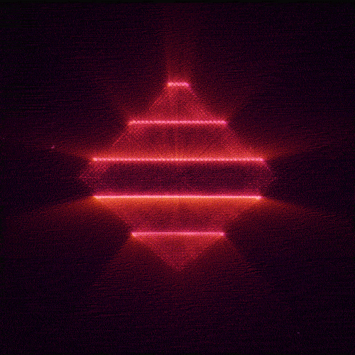

# 

<table>
<tr>
<td width="70%" valign="top">

  Hi, I'm Levan, a QA Testing Engineer from Georgia.

  🔬 I'm a passionate engineer focused on Quality Assurance, automated solutions, and enhancing software quality.

  🎼 Guitarist in a band. Passionate about music

  🎓 I study at Tbilisi State Medical University, Faculty of Medicine.

  💻 I have a rich blend of experience and expertise, and I've been immersed in the world of coding for a while now.

  📚 I'm actively learning Python, JavaScript/TypeScript, Playwright, Cypress, WDIO (Selenium/WebDriver-based), and testing methodologies to deepen my engineering expertise.

  📫 Reach me anytime: tsertsvadze2005@gmail.com

</td>

<td width="30%" align="center">

</td>
</tr>
</table>

# Skills:

## Frameworks and languages:

  <a href="https://skillicons.dev">
    
     
    
  </a>

## 📈 GitHub analytics

  
  
  

  <picture>
    <source media="(prefers-color-scheme: dark)" srcset="https://raw.githubusercontent.com/TarieliCrcv/TarieliCrcv/output/github-contribution-grid-snake-dark.svg">
    <source media="(prefers-color-scheme: light)" srcset="https://raw.githubusercontent.com/TarieliCrcv/TarieliCrcv/output/github-contribution-grid-snake.svg">
    
  </picture>

